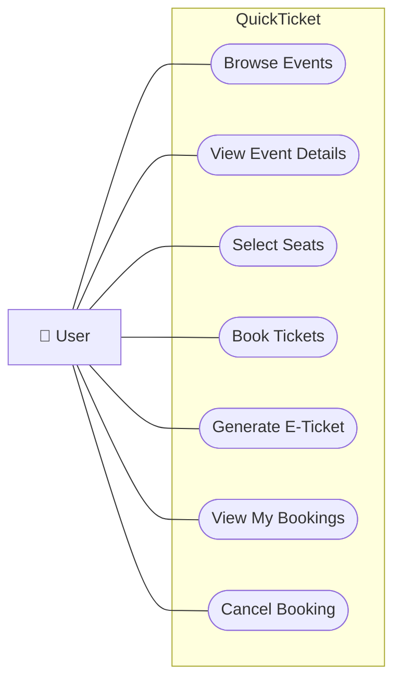

# 🎫 QuickTicket - Online E-Ticket Booking System

A modern, frontend-focused web application for booking tickets to **movies, concerts, buses, and trains**. Built with **React and Vite**.

---

## 👤 Use Case Diagram

The use case diagram shows how a user interacts with the main features of QuickTicket.



---

## ✨ Features

* 🎬 **Browse Events** - View movies, concerts, buses, and trains
* 🎫 **Event Details** - See date, time, venue, and pricing information
* 💺 **Seat Selection** - Interactive seat selection interface
* 📱 **E-Ticket Generation** - Automatic e-ticket with QR code
* 📋 **My Bookings** - View and manage all your bookings
* ❌ **Cancel Bookings** - Cancel upcoming bookings
* 💾 **Local Storage** - All data stored in browser localStorage

---

## 🚀 Getting Started

### Prerequisites

* Node.js (v16 or higher)
* npm or yarn

### Installation

1. Install dependencies:

```bash
npm install
```

2. Start the development server:

```bash
npm run dev
```

3. Open your browser and navigate to:

```text
http://localhost:5173
```

---

## 📦 Build for Production

```bash
npm run build
```

The built files will be available in the `dist` directory.

---

## 📁 Project Structure

```text
QuickTicket/
├── src/
│   ├── components/
│   │   ├── EventListing.jsx      # Browse all events
│   │   ├── EventDetails.jsx      # Event details and seat selection
│   │   ├── ETicket.jsx           # E-ticket display with QR code
│   │   └── MyBookings.jsx        # View and cancel bookings
│   │
│   ├── data/
│   │   └── mockEvents.js         # Mock event data
│   │
│   ├── utils/
│   │   └── storage.js            # localStorage utilities
│   │
│   ├── App.jsx                   # Main app component with routing
│   ├── main.jsx                  # Entry point
│   └── index.css                 # Global styles
│
├── index.html
├── package.json
└── vite.config.js
```

---

## 📖 Usage

### 1. Browse Events

Click on any event card to view available movies, concerts, buses, or trains.

### 2. Select Seats

Choose your preferred seats from the interactive seat map.

### 3. Book Tickets

Enter the required details and confirm your booking.

### 4. View E-Ticket

Your e-ticket with a generated QR code will be displayed automatically.

### 5. Manage Bookings

Navigate to **My Bookings** to view your existing tickets or cancel upcoming bookings.

---

## 🛠️ Technologies Used

* **React 18**
* **React Router DOM**
* **Vite**
* **QRCode.react**
* **CSS3**
* **Browser localStorage**

---

## 💾 Data Storage

QuickTicket uses browser **localStorage** to store booking information.

* Bookings persist across browser sessions
* No external database is required
* Booking information is stored locally
* QR codes contain booking information in JSON format

---

## 📝 Notes

* All bookings are stored in browser localStorage
* Data persists across browser sessions
* QR codes contain booking information in JSON format
* Maximum **10 seats** can be selected per booking

---

## 📄 License

This project is licensed under the **MIT License**.
